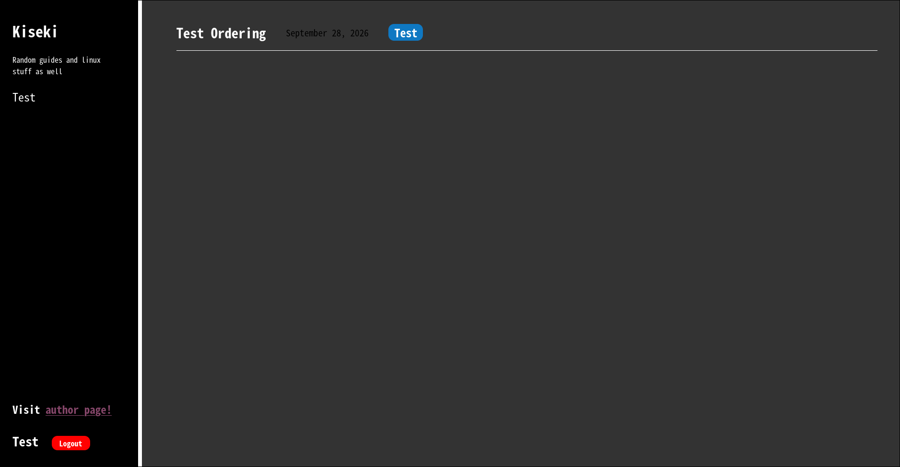
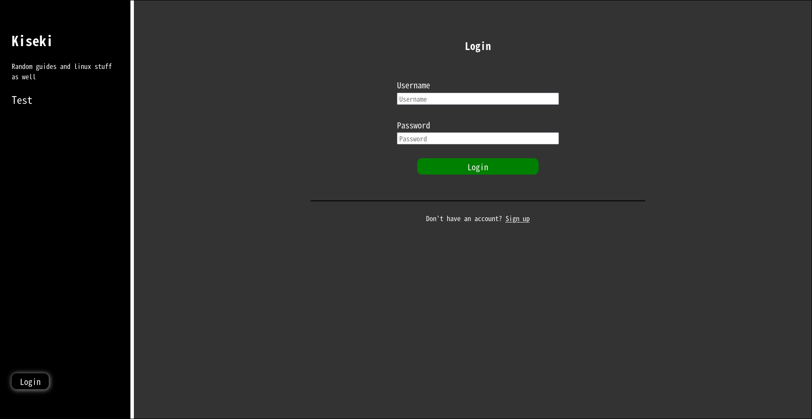
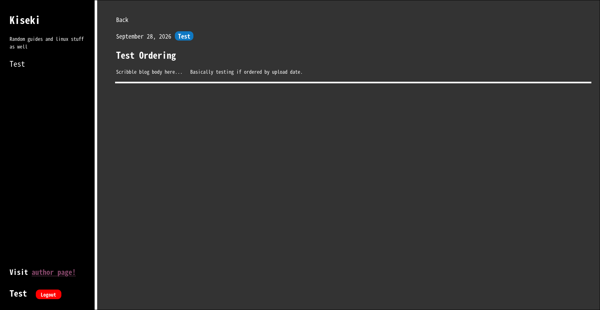
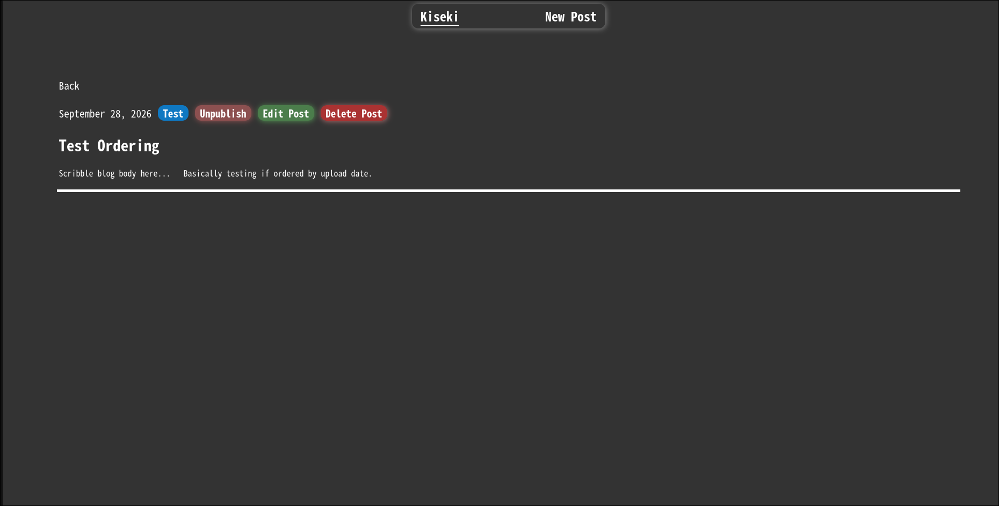
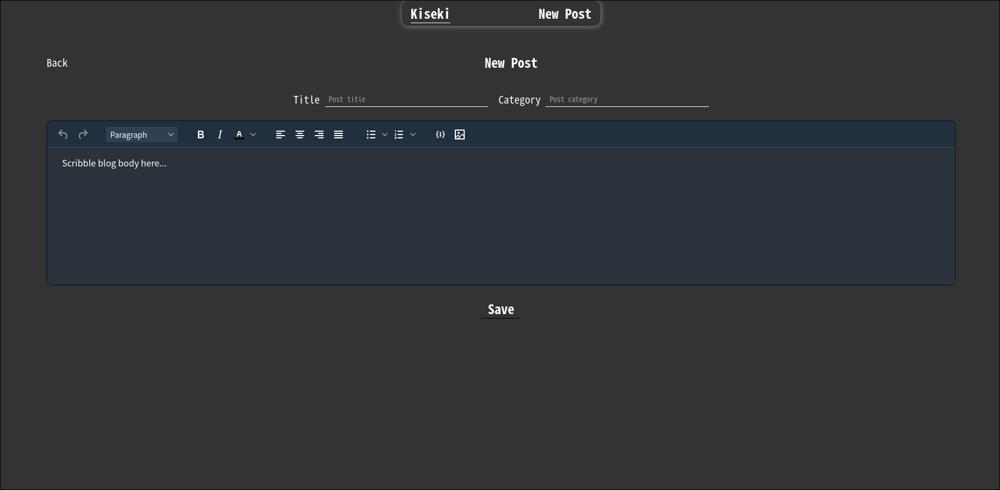

# Kiseki
A full-stack blog application where users can view blog posts and authors can write new posts and edit old posts as well as publish or unpublish posts.

## Features
- User authentication using JWT
- Blog CRUD.
- Blog content sanitization.

## Tech Stack
**Frontend:** React, CSS, React Router, React-hot-toast, TinyMCE
**Backend:** NodeJS, Express
**Database:** Postgres, Supabase

## Screenshots
**Main Page**

**Login/Register Page**

**Blog Post Page**

**Author Page**

**New/Edit Post Page**

## Limitations
1. No code formatting for uploaded blogs.
